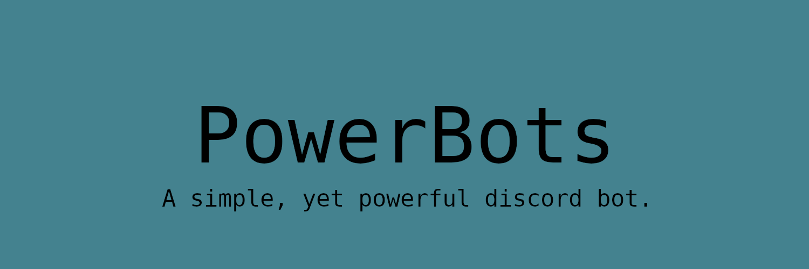

<h1 style="text-align: center;">

</h1>

<div align="center">

[](https://discord.gg/jKSrkhSG4V)
[](https://discord.com/oauth2/authorize?client_id=1397525248202637312)
[](https://powerbots.bnajns.hackclub.app)

</div>

## Description

PowerBots is a simple yet powerful discord bot, with multiple commands in multiple categories, such as moderation tools, image manipulation, fun commands, apis, etc.

The goal of this project is to just fit as much tools/commands as possible, in one bot.

## Features

- All the moderation tools you need, ranging from notes to bans.
- Image manipulation commands, such as deepfry, pixelate, and togif.
- Basic utility commands such as serverinfo, whois, and more.
- And other commands such as 8ball, coinflip, github, npm, dictionary, etc.

## Commands

- `/about` - Shows basic info and related links.
- `/commands` - Shows basic commands, links to commands.md.
- `/ping` - Check if the bot is up, shows ping latency.
- `/coinflip` - Flip a coin.
- `/dictionary` - Define a word from the dictionary.
- `/deepfry` - Deepfries an image.
- `/notes` - Add a mod note to an user.

More commands can be found via [commands.md](commands.md).

## Screenshot


## Quick Start

1. **Clone the repository**

   ```sh
   git clone https://github.com/BananaJeanss/powerbots.git
   cd powerbots
   ```

2. **Install dependencies**

   ```sh
   npm install
   ```

3. **Set up environment variables**

   ```sh
   cp .env.example .env
   ```

4. **Deploy commands**

   ```sh
   npm run deploy-commands
   ```

5. **Start the bot**

   ```sh
   npm run start
   ```

## Contributing

Contributions are welcome! Please feel free to:

- Report bugs/suggest new features by [opening an issue](https://github.com/BananaJeanss/powerbots/issues)
- Submit pull requests for improvements

### Contributors

[](https://github.com/BananaJeanss/powerbots/graphs/contributors)

## License

This project is licensed under the MIT License, see the [LICENSE](LICENSE) file for details.
